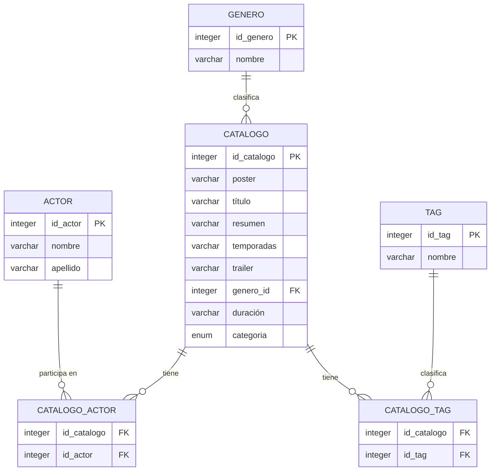

# 🎬 Trailerflix API

      

**Trailerflix** es una API REST desarrollada con **Node.js** y **Express** que permite explorar un catálogo de películas y series a través de múltiples rutas organizadas.

## 🚀 Características

- 📚 **Catálogo completo**  
  Accedé al listado de todas las películas y series disponibles en Trailerflix.

- 🔠 **Búsqueda por título**  
  Encontrá películas o series buscando por título parcial o completo.

- 🆔 **Consulta por ID**  
  Obtené los detalles de una película o serie específica a partir de su ID.

- 🎬 **Filtrado por tipo de contenido**  
  Separá el catálogo por tipo: películas o series.

- 🎭 **Gestión de actores**  
  Consultá el listado completo de actores, buscá por nombre y apellido, y conocé en qué contenidos actúan.

- 🎞 **Acceso a trailers oficiales**  
  Visualizá el trailer de una película o serie usando su ID único.

- 🛠 **Administración de contenido**  
  Agregá, editá o eliminá películas, series o actores desde endpoints protegidos para gestión del catálogo.

- 🔍 **Vista SQL unificada**  
  Mostrá todos los datos combinados desde una vista SQL que respeta el modelo JSON del proyecto.

## 📖 Estructura de los Datos

De cada película o serie se contiene la siguiente información:

- **id**: Identificador único de la película o serie.
- **poster**: Enlace a la imagen del poster de la película o serie.
- **titulo**: Título de la película o serie.
- **resumen**: Breve descripción de la película o serie.
- **temporadas**: Número de temporadas (si es una serie).
- **duracion**: Duración de la película (si es una película).
- **trailer**: Enlace al trailer de la película o serie (si está disponible).
- **categoria**: Si se trata de una película o serie.
- **genero**: Nombre del género de la película o serie.
- **reparto**: Actores/actrices que participan en la película o serie.
- **tags**: Palabras clave asociadas a la película o serie.

## 📦 Instalación

⚠️ **Importante:**

- Si deseás correr la app localmente con tu propia base de datos tené en cuenta las siguientes consideraciones:
  - Para la correcta funcionalidad de la API, es necesario crear la base de datos MySQL ejecutando el script `create_trailerflix_schema.sql` que se encuentra dentro de la carpeta `migrations` en `database`. Luego, para incorporar los datos de ejemplo, se debe ejecutar el script `trailerflix_inserts.sql` dentro de la misma carpeta.
  - Se debe configurar la conexión a la base de datos en el archivo `.env` con las variables `DB_HOST`, `DB_USER`, `DB_PASS` y `DB_NAME`.
  - Si se desea utilizar la ruta de vista SQL se debe ejecutar el script `view_json.sql` que se encuentra dentro de la carpeta `scripts`.

1. Cloná el repositorio:
   ```bash
   git clone https://github.com/agusrnfr/api-trailerflix.git
   cd api-trailerflix
   ```
2. Instalá las dependencias:

   ```bash
   npm install
   ```

   O podés instalar express, dotenv, nodemon, sequelize y mysql2 por separado:

   ```bash
   npm install express
   npm install dotenv
   npm install --save-dev nodemon
   npm install sequelize
   npm install mysql2
   ```

3. Ejecutá el servidor:
   - En modo desarrollo (con nodemon):
     ```bash
     npm run dev
     ```
   - En modo producción:
     ```bash
     npm start
     ```
4. Accedé a la API a través de un navegador o herramienta de pruebas en la siguiente URL:
   ```bash
   http://localhost:3008/
   ```

# 📘 Documentación de Endpoints - Trailerflix API

## 🎬 Catálogo

| Método | Endpoint                   | Descripción                 | Parámetros       | Restricciones y Validaciones                                                                                                                                                                                                                                                                                                              |
| ------ | -------------------------- | --------------------------- | ---------------- | ----------------------------------------------------------------------------------------------------------------------------------------------------------------------------------------------------------------------------------------------------------------------------------------------------------------------------------------- |
| GET    | `/catalogo`                | Obtener todo el catálogo    | -                | Devuelve 404 si está vacío                                                                                                                                                                                                                                                                                                                |
| GET    | `/catalogo/titulo/:titulo` | Buscar contenido por título | `:titulo`        | Requiere valor, match parcial (LIKE `%titulo%`)                                                                                                                                                                                                                                                                                           |
| GET    | `/catalogo/id/:id`         | Obtener contenido por ID    | `:id`            | `id` debe ser entero positivo, 404 si no existe                                                                                                                                                                                                                                                                                           |
| GET    | `/catalogo/tipo/pelicula`  | Listar todas las películas  | -                | 404 si no hay                                                                                                                                                                                                                                                                                                                             |
| GET    | `/catalogo/tipo/serie`     | Listar todas las series     | -                | 404 si no hay                                                                                                                                                                                                                                                                                                                             |
| POST   | `/catalogo/alta`           | Crear nuevo contenido       | JSON body        | - `titulo`, `categoria`, `genero_id` obligatorios<br>- `categoria` debe ser `"Película"` o `"Serie"`<br>- `actores_id` y `tags_id`: arrays no vacíos<br>- Si es `"Serie"`, `temporadas` obligatorio y entero positivo<br>- Si es `"Película"`, `duracion` obligatorio y debe seguir el patron "número minutos", por ejemplo "120 minutos" |
| PUT    | `/catalogo/editar/:id`     | Editar contenido existente  | `:id`, JSON body | Igual a las validaciones del POST + verificación de existencia                                                                                                                                                                                                                                                                            |
| DELETE | `/catalogo/eliminar/:id`   | Eliminar contenido por ID   | `:id`            | `id` válido, verifica existencia antes de borrar                                                                                                                                                                                                                                                                                          |

---

## 🎭 Actores

| Método | Endpoint                                         | Descripción                            | Parámetros                  | Restricciones y Validaciones                   |
| ------ | ------------------------------------------------ | -------------------------------------- | --------------------------- | ---------------------------------------------- |
| GET    | `/actores`                                       | Obtener todos los actores              | -                           | 404 si no hay actores                          |
| GET    | `/actores/nombre/:nombre`                        | Buscar actores por nombre              | `:nombre`                   | Requiere valor, match parcial                  |
| GET    | `/actores/nombre-completo?nombre=..&apellido=..` | Buscar actor por nombre y apellido     | Query: `nombre`, `apellido` | Ambos obligatorios                             |
| GET    | `/actores/id/:id`                                | Obtener actor por ID                   | `:id`                       | `id` entero positivo, 404 si no existe         |
| POST   | `/actores/alta`                                  | Crear nuevo actor                      | JSON body                   | `nombre` y `apellido` requeridos               |
| PUT    | `/actores/editar/:id`                            | Editar actor                           | `:id`, JSON body            | Igual a POST + validación de existencia        |
| DELETE | `/actores/eliminar/:id`                          | Eliminar actor por ID                  | `:id`                       | `id` válido, verifica existencia               |
| GET    | `/actores/id/:id/catalogo`                       | Obtener catálogo en que actúa un actor | `:id`                       | 404 si el actor no existe o no tiene contenido |
| GET    | `/actores/id/:id/catalogo/titulo/:titulo`        | Obtener contenido por actor y título   | `:id`, `:titulo`            | 404 si no hay resultados                       |
| GET    | `/actores/id/:id/catalogo/tipo/serie`            | Obtener series en las que actúa        | `:id`                       | Filtro por `categoria: "Serie"`                |
| GET    | `/actores/id/:id/catalogo/tipo/pelicula`         | Obtener películas en las que actúa     | `:id`                       | Filtro por `categoria: "Película"`             |

---

## 🎞️ Géneros

| Método | Endpoint                         | Descripción                                          | Parámetros | Restricciones y Validaciones                                                            |
| ------ | -------------------------------- | ---------------------------------------------------- | ---------- | --------------------------------------------------------------------------------------- |
| GET    | `/generos`                       | Obtener todos los géneros                            | -          | Devuelve 404 si no hay géneros                                                          |
| GET    | `/generos/:nombre`               | Obtener catálogo por género (por nombre)             | `:nombre`  | Match parcial, insensible a mayúsculas. Devuelve 404 si no hay resultados               |
| GET    | `/generos/tipo/pelicula/:nombre` | Obtener películas asociadas a un género (por nombre) | `:nombre`  | Match parcial, insensible a mayúsculas. Devuelve 404 si no hay películas que coincidan. |
| GET    | `/generos/tipo/serie/:nombre`    | Obtener series asociadas a un género (por nombre)    | `:nombre`  | Match parcial, insensible a mayúsculas. Devuelve 404 si no hay series que coincidan.    |

---

## 🔍 Vista SQL

| Método | Endpoint            | Descripción                          | Parámetros | Restricciones            |
| ------ | ------------------- | ------------------------------------ | ---------- | ------------------------ |
| GET    | `/trailerflix/view` | Muestra el contenido de la vista SQL | -          | 404 si no hay resultados |

---

## 📌 Notas

- Cuando se obtiene el catálogo completo, se incluyen todos los campos relevantes de cada película o serie, como `id`, `poster`, `titulo`, `resumen`, `temporadas`, `duracion`, `trailer`, `categoria`, `genero`, `reparto` y `tags`.
- Cuando se busca el catálogo, ya sea de un actor específico, por titulo, por tipo o por género, se devuelve un objeto que incluye la cantidad de resultados y el catálogo en sí.
- Al buscar actores por nombre, se realiza una búsqueda de solo el campo `nombre`, permitiendo coincidencias parciales.
- La búsqueda de actores por nombre completo requiere que ambos campos (`nombre` y `apellido`) sean obligatorios.
- En los endpoints de creación y edición, se valida que los campos obligatorios estén presentes y que los valores sean correctos (por ejemplo, `categoria` debe ser `"Película"` o `"Serie"`).
- El archivo `create_insert.py` dentro de la carpeta `scripts` fue el utilizado para pasar el JSON `trailerflix.json` a un formato SQL para insertar en la base de datos.

## 📝 Esquema de la Base de Datos


## 📐 Normalización y Tercera Forma Normal (3FN)

El modelo de datos de **TrailerFlix** fue diseñado respetando los principios de normalización hasta la **Tercera Forma Normal (3FN)**, lo cual garantiza integridad, eficiencia y evita redundancias innecesarias.

Las características que lo demuestran son:

- ✅ Todos los campos son **atómicos** (1FN): no existen columnas que contengan múltiples valores en una sola celda.
- ✅ Cada campo **no clave depende completamente de la clave primaria** de su tabla (2FN).
- ✅ No hay **dependencias transitivas** entre campos no clave (3FN).




#### Ejemplos de diseño normalizado:

- La relación entre `Catalogo` y `Genero` se gestiona mediante una clave foránea (`genero`), evitando repetir nombres de género en cada fila.
- Las relaciones **muchos a muchos** (N:M), como las de `Catalogo` con `Tag` o `Actor`, se manejan mediante **tablas intermedias** (`Catalogo_Tag` y `Catalogo_Actor`), lo que evita duplicación de datos y facilita modificaciones.
- El campo `categoria` utiliza un tipo `ENUM` para asegurar consistencia entre valores posibles (`Pelicula` o `Serie`), sin necesidad de una tabla adicional.

Este diseño permite escalar la base de datos manteniendo la coherencia y facilita futuras consultas y mantenimientos.

## 📂 Ejemplo de Elemento de Catálogo

```json
{
	"id": 99,
	"poster": "https://a.ltrbxd.com/resized/sm/upload/kv/7n/p8/tv/fMC8JBWx2VjsJ53JopAcFjqmlYv-0-1000-0-1500-crop.jpg?v=3d69c00608",
	"titulo": "Mulholland Drive",
	"resumen": "Una joven actriz llega a Los Ángeles persiguiendo el sueño de triunfar en Hollywood, pero se ve envuelta en un misterioso enigma cuando conoce a una mujer con amnesia tras un accidente. Juntas intentan reconstruir su identidad, mientras la narrativa se fragmenta en una espiral de sueños, ilusiones y realidades distorsionadas. La película explora temas como el deseo, la culpa, la identidad y el lado oscuro del espectáculo.",
	"temporadas": null,
	"duracion": "147 minutos",
	"trailer": "https://www.youtube.com/watch?v=jbZJ487oJlY",
	"categoria": "Película",
	"genero": "Suspenso",
	"reparto": "Naomi Watts, Laura Harring, Justin Theroux, Billy Ray Cyrus, Ann Miller, Melissa George",
	"tags": "Drama, Misterio, Crimen, Suspenso, Terror, Intriga, Fantasía, Sucesos"
}
```

## 🛠️ Ejemplo de Uso

Para probar la API, podés usar herramientas como **Postman**, **Insomnia** o **Thunder Client**.

_📎 Para facilitar las pruebas, podés consultar solicitudes de ejemplo en [`scripts/solicitudes_ejemplo.txt`](scripts/solicitudes_ejemplo.txt)_

A continuación, se muestran algunos ejemplos de cómo interactuar con los distintos endpoints de la API:

### 📦 Obtener todo el catalogo

#### 📩 Solicitud

```http
GET /catalogo
```

#### 📝 Respuesta

```json
{
	"cantidad": 97,
	"catalogo": [
		{
			"id": 1,
			"poster": "./posters/1.jpg",
			"titulo": "The Crown",
			"resumen": "Este drama narra las rivalidades políticas y el romance de la reina Isabel II, así como los sucesos que moldearon la segunda mitad del siglo XX.",
			"temporadas": 4,
			"duracion": null,
			"trailer": "https://www.youtube.com/embed/JWtnJjn6ng0",
			"categoria": "Serie",
			"genero": "Suceso Real",
			"reparto": "Claire Fox, Olivia Colman, Matt Smith, Tobias Menzies, Vanesa Kirby, Helena Bonham Carter",
			"tags": "Drama, Suceso Real"
		},
		{
			"id": 2,
			"poster": "./posters/2.jpg",
			"titulo": "Riverdale",
			"resumen": "El paso a la edad adulta incluye sexo, romance, escuela y familia. Para Archie y sus amigos, también hay misterios oscuros.",
			"temporadas": 5,
			"duracion": null,
			"trailer": "https://www.youtube.com/embed/HxtLlByaYTc",
			"categoria": "Serie",
			"genero": "Drama",
			"reparto": "Lili Reinhart, Casey Cott, Camila Mendes, Marisol Nichols, Madelaine Petsch, Mädchen Amick",
			"tags": "Drama, Ficción, Misterio"
		}
		// ... más resultados
	]
}
```

### 🔍 Buscar por título

#### 📩 Solicitud

```http
GET /catalogo/titulo/mulholland
```

#### 📝 Respuesta

```json
{
	"cantidad": 1,
	"catalogo": [
		{
			"id": 99,
			"poster": "https://a.ltrbxd.com/resized/sm/upload/kv/7n/p8/tv/fMC8JBWx2VjsJ53JopAcFjqmlYv-0-1000-0-1500-crop.jpg?v=3d69c00608",
			"titulo": "Mulholland Drive",
			"resumen": "Una joven actriz llega a Los Ángeles persiguiendo el sueño de triunfar en Hollywood, pero se ve envuelta en un misterioso enigma cuando conoce a una mujer con amnesia tras un accidente. Juntas intentan reconstruir su identidad, mientras la narrativa se fragmenta en una espiral de sueños, ilusiones y realidades distorsionadas. La película explora temas como el deseo, la culpa, la identidad y el lado oscuro del espectáculo.",
			"temporadas": null,
			"duracion": "147 minutos",
			"trailer": "https://www.youtube.com/watch?v=jbZJ487oJlY",
			"categoria": "Película",
			"genero": "Suspenso",
			"reparto": "Naomi Watts, Laura Harring, Justin Theroux, Justin Theroux, Billy Ray Cyrus, Ann Miller",
			"tags": "Fantasía, Drama, Sucesos, Misterio, Crimen, Suspenso, Terror, Intriga"
		}
	]
}
```

### 🎞 Buscar por tipo

#### 📩 Solicitud

```http
GET /catalogo/tipo/pelicula
```

#### 📝 Respuesta

```json
{
	"tipo": "Película",
	"cantidad": 72,
	"catalogo": [
		{
			"id": 6,
			"poster": "./posters/6.jpg",
			"titulo": "Enola Holmes",
			"resumen": "La hermana menor de Sherlock, descubre que su madre ha desaparecido y se dispone a encontrarla. En su búsqueda, saca a relucir el sabueso que corre por sus venas y se encuentra con una conspiración que gira en torno a un misterioso lord, demostrando que su ilustre hermano no es el único talento en la familia.",
			"temporadas": null,
			"duracion": "97 minutos",
			"trailer": "https://www.youtube.com/embed/3t1g2pa355k",
			"categoria": "Película",
			"genero": "Drama",
			"reparto": "Helena Bonham Carter, Millie Bobby Brown, Henry Cavill, Sam Claflin, Louis Partridge, Adeel Akhtar",
			"tags": "Drama, Ficción, Misterio"
		},
		{
			"id": 7,
			"poster": "./posters/7.jpg",
			"titulo": "Guasón",
			"resumen": "Arthur Fleck (Phoenix) es un hombre ignorado por la sociedad, cuya motivación en la vida es hacer reír. Pero una Serie de trágicos acontecimientos le llevarán a ver el mundo de otra forma. Película basada en el popular personaje de DC Comics Joker, conocido como archivillano de Batman, pero que en este film tomará un cariz más realista y oscuro.",
			"temporadas": null,
			"duracion": "97 minutos",
			"trailer": "https://www.youtube.com/embed/zAGVQLHvwOY",
			"categoria": "Película",
			"genero": "Suspenso",
			"reparto": "Joaquin Phoenix, Robert De Niro, Zazie Beetz, Frances Conroy, Brett Cullen, Shea Whigham",
			"tags": "Crimen, Suspenso"
		}
		// ... más películas
	]
}
```

### 👤 Obtener actor por nombre

#### 📩 Solicitud

```http
GET /actores/nombre/naomi
```

#### 📝 Respuesta

```json
[
	{
		"id_actor": 840,
		"nombre": "Naomi",
		"apellido": "Watts"
	}
]
```

### 🎥 Obtener catalogo de actor por ID

#### 📩 Solicitud

```http
GET /actores/id/840/catalogo
```

#### 📝 Respuesta

```json
{
	"actor": {
		"id": 840,
		"nombre": "Naomi",
		"apellido": "Watts"
	},
	"cantidad": 1,
	"catalogo": [
		{
			"id": 99,
			"poster": "https://a.ltrbxd.com/resized/sm/upload/kv/7n/p8/tv/fMC8JBWx2VjsJ53JopAcFjqmlYv-0-1000-0-1500-crop.jpg?v=3d69c00608",
			"titulo": "Mulholland Drive",
			"resumen": "Una joven actriz llega a Los Ángeles persiguiendo el sueño de triunfar en Hollywood, pero se ve envuelta en un misterioso enigma cuando conoce a una mujer con amnesia tras un accidente. Juntas intentan reconstruir su identidad, mientras la narrativa se fragmenta en una espiral de sueños, ilusiones y realidades distorsionadas. La película explora temas como el deseo, la culpa, la identidad y el lado oscuro del espectáculo.",
			"temporadas": null,
			"duracion": "147 minutos",
			"trailer": "https://www.youtube.com/watch?v=jbZJ487oJlY",
			"categoria": "Película",
			"genero": "Suspenso",
			"tags": "Fantasía, Drama, Sucesos, Misterio, Crimen, Suspenso, Terror, Intriga"
		}
	]
}
```

## 👥 Desarrolladoras

- **Agostina Paoletti** - [agostinapaoletti](https://github.com/Chinapaoletti)
- **Agustina Rojas** - [agusrnfr](https://github.com/agusrnfr)
- **Karina Chilque** - [karinachilque]()
